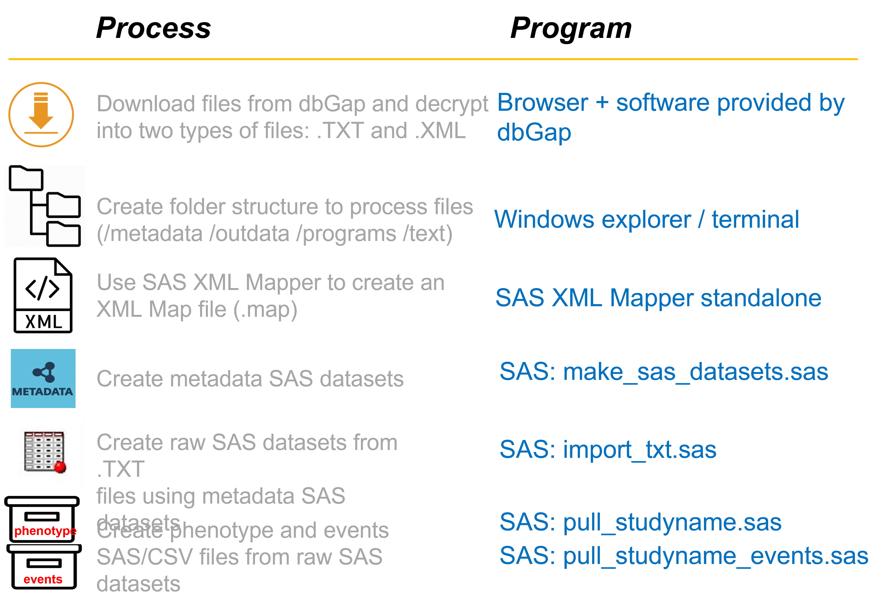

# Manual Harmonization for Stroke Risk Prediction Cohorts

## Data Manipulation Summary

## From dbGap to raw SAS datasets

## From Phenptype and Event Data to Analysis Dataset

1. Determine what visits (or exams) will be used from each cohort
2. Specify inclusion and exclusion criteria
3. Extract phenotype data for participants meeting the inclusion/exclusion criteria from phenotype dataset
4. Extract events from event history datasets including time relative to the visit (or exam) selected for analysis
5. Combine all the cohorts into an analysis dataset

## Detailed Procedure

Below we describe the series of steps necessary to convert the phenotype data, which is downloaded from the dbGaP website, from raw form to final SAS analysis data sets. The steps described here pertain only to the cohort phenotype data, and assume that the downloaded phenotype files have already been decrypted (per dbGaP provided instructions), using the "vdb-decrypt" command and the dbGaP project repository key (the file with the suffix ".ngc").

The entire process has been executed and completed for Framingham (Offspring), MESA, and ARIC cohorts. In discussing files and directory structures, the Framingham cohort will be used as the example. The Framingham phenotype source data that was downloaded from the dbGaP website resides in these two directories:

    data/framingham/dbgap/phenotype_files
    data/framingham/dbgap2/phenotype_files

The full population of Framingham Offspring patients is divided among two "consent groups": "dbgap" and "dbgap2" (data for each consent group is stored in the two file paths specified above, respectively). Each consent group contains the same cluster of downloaded raw data sets, containing different subsets of the total population of patients. The source data in these directories consists of .txt and .xml files, which are later combined to create raw SAS data sets (described below).

# Links
- [dbGaP](https://www.ncbi.nlm.nih.gov/gap/)
- [Framingham (Offspring)](https://www.ncbi.nlm.nih.gov/projects/gap/cgi-bin/study.cgi?study_id=phs000007.v32.p13)
- [ARIC](https://www.ncbi.nlm.nih.gov/projects/gap/cgi-bin/study.cgi?study_id=phs000280.v7.p1)
- [MESA](https://www.ncbi.nlm.nih.gov/projects/gap/cgi-bin/study.cgi?study_id=phs000209.v13.p3)
